# pix2pix

Tensorflow 2.x implementation of [Image-to-Image Translation with Conditional Adversarial Net](https://arxiv.org/abs/1611.07004) paper, better known as [pix2pix](https://phillipi.github.io/pix2pix/).

### Results

#### Results on satelite to maps dataset

Model was trained for 200 epochs with a batch size of 1 and a learning schedule that linearly decayed learining rate after half the epochs passed.
Both training and validation data was used to train the generator. Subjectively results are somewhat worse than what I was able to reproduce with [reference implementation](https://github.com/junyanz/pytorch-CycleGAN-and-pix2pix).

From left to right, images below show:
- input satelite image
- generated google maps image
- ground truth google maps image

##### Successful predictions
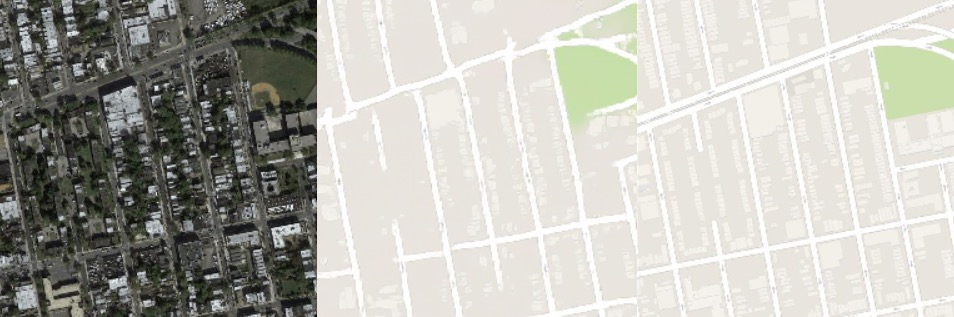
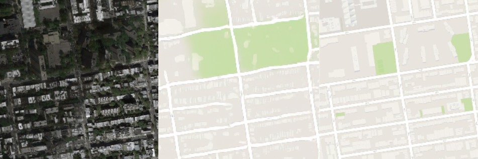
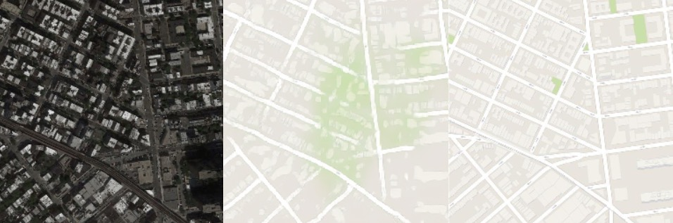
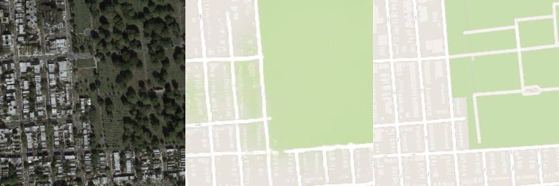
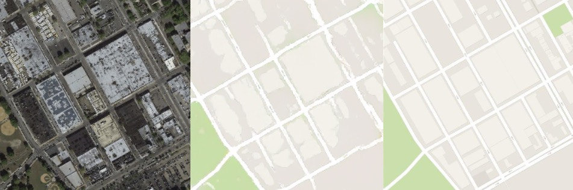
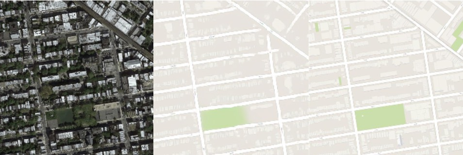

##### Failed predictions
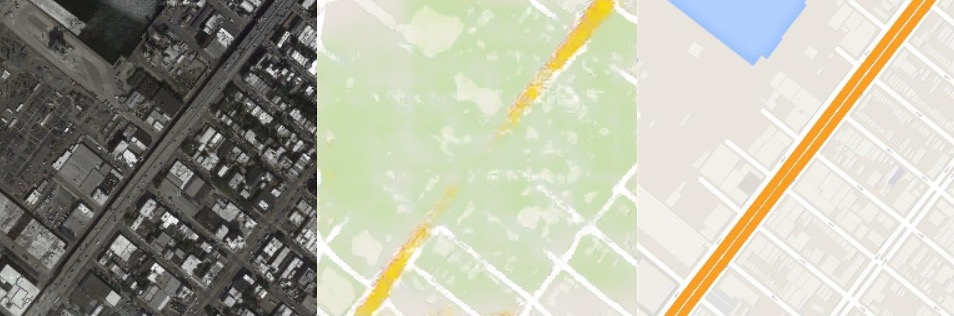
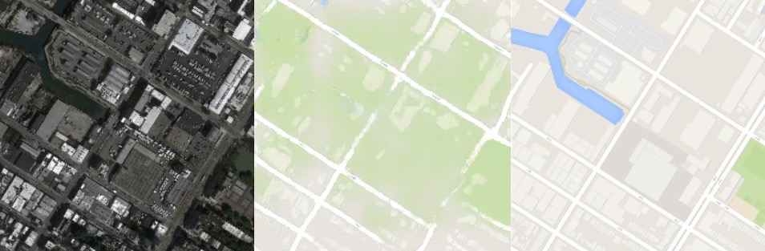
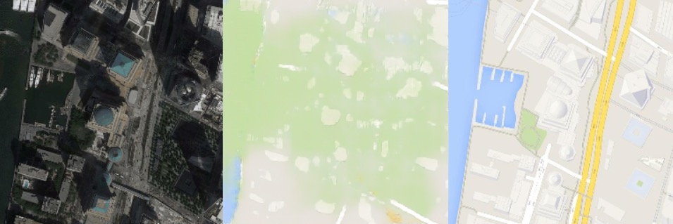
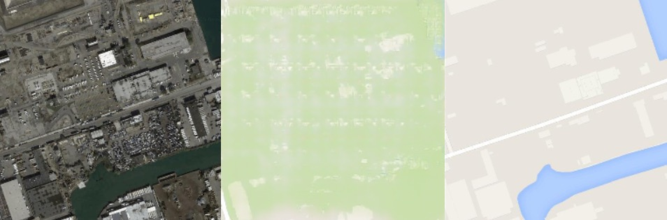
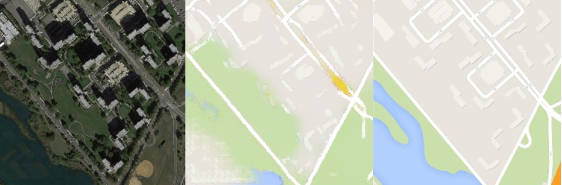
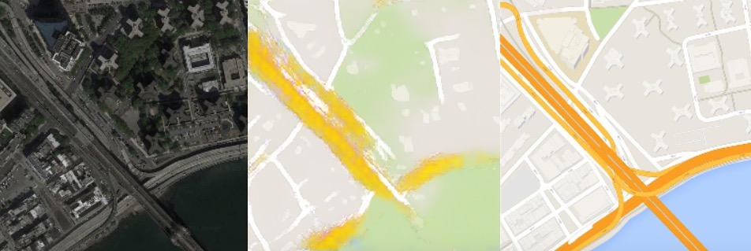

---

#### Results on facades dataset

Model was trained for 1000 epochs with a batch of 8 and a fixed learning rate. There aren't really any obvious failures in predictions.

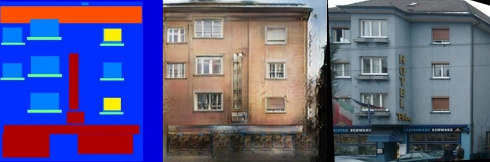
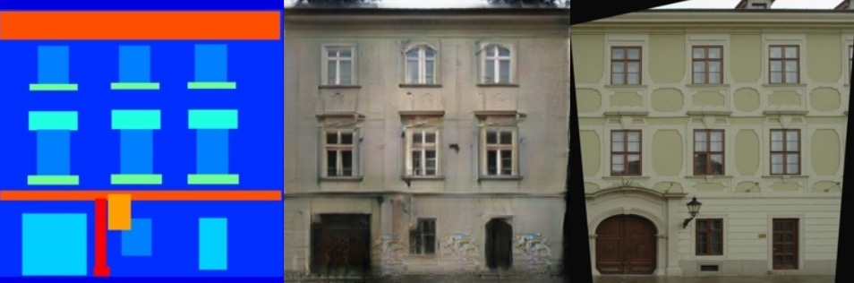
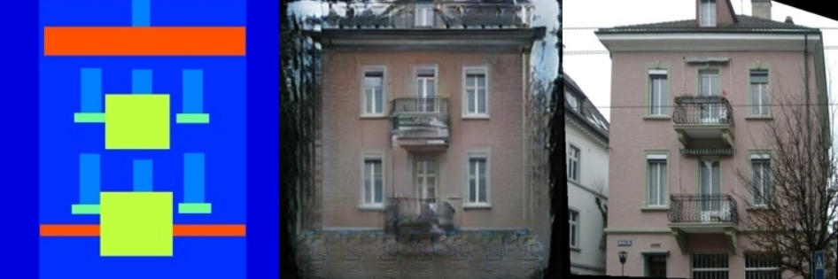
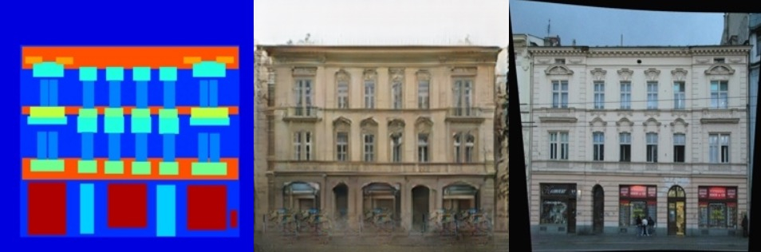
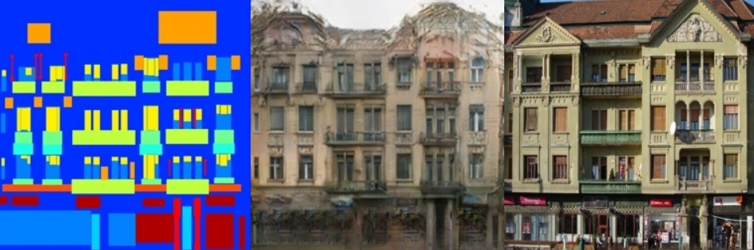
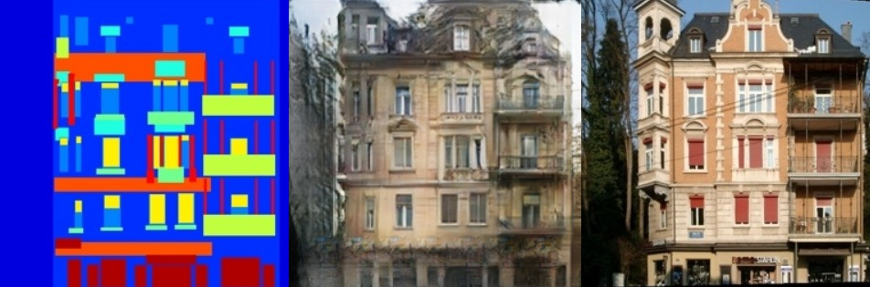

### How to run

This project can be run in a docker container.
You can build the docke rimage manually with docker, but there is also an [invoke][invoke] task provided: `invoke host.build-app-container`. You'll need `invoke` on your host system to run it.

You can start the container with `invoke host.run {/path/to/configuration.yaml}` command that takes care of mounting paths for data volume, using GPU if available, etc.

Once inside container, following key `invoke` commands are available:
-  train.train-facades-gan - Train GAN model on facades dataset.
-  train.train-maps-gan - Train GAN model on maps dataset.
-  visualize.facades-model-predictions - Visualize facades model predictions
-  visualize.maps-model-predictions - Visualize maps model predictions
-  visualize.visualize-facades-data - Visualize facades data
-  visualize.visualize-maps-data - Visualize maps data

Most commands accept `--config-path` argument that accepts a path pointing to a configuration file. Sample configuration file is provided at `./config.yaml`.

[invoke]: https://www.pyinvoke.org/